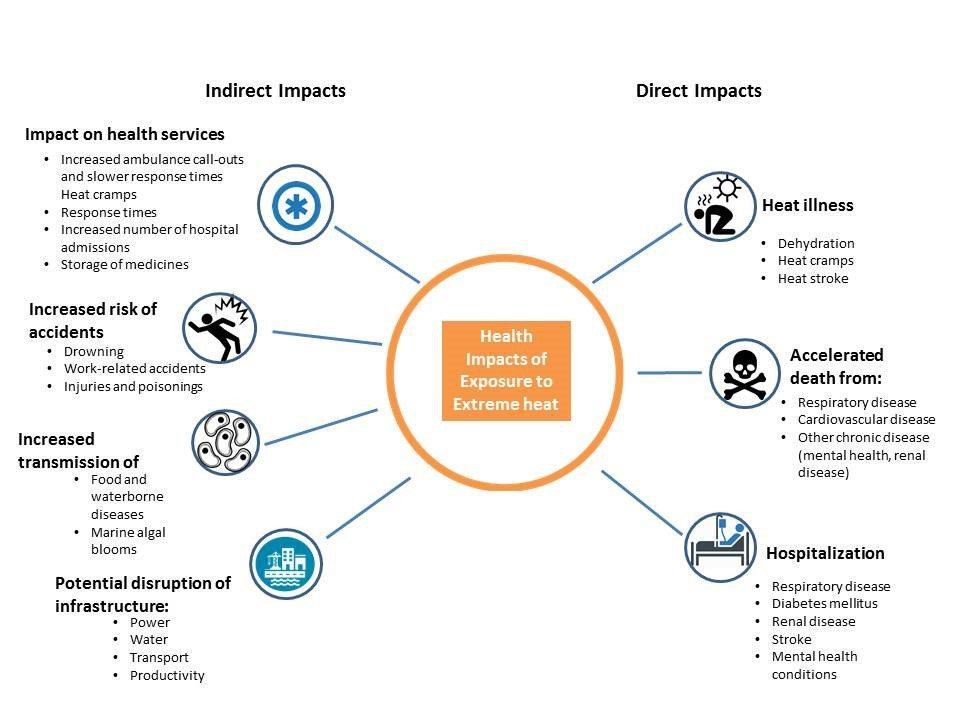
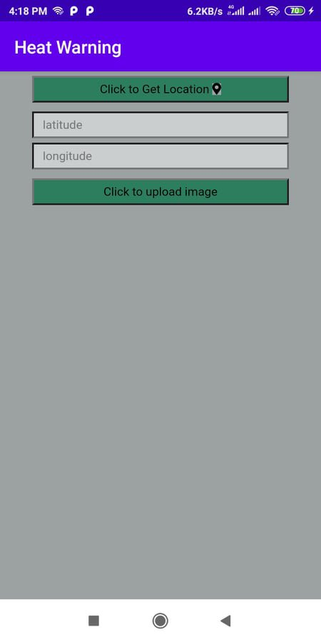
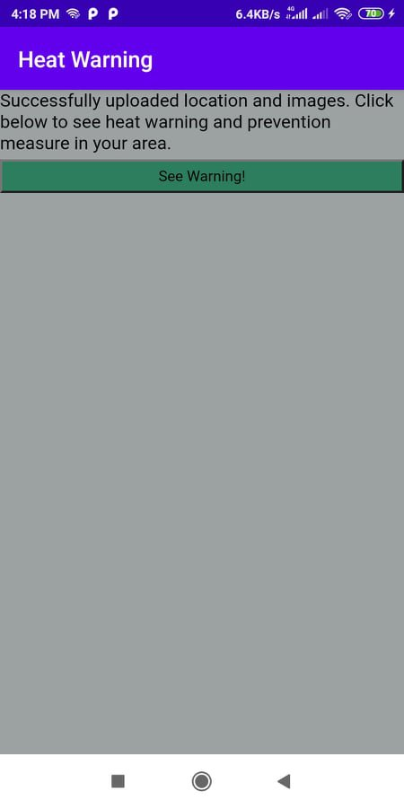

# Nasa-Space-Apps-Challenge-2021
### We go for better world  
<h3><pre>Team: Dynamo Warrior</pre></h3>
<h4>Team Member</h4>
<ol>
    <li><a href="https://github.com/mazhar11-cou">Mazharul Hasan</a></li>
    <li><a href="https://github.com/mazhar11-cou/Nasa-Space-Apps-Challenge-2021">Fozilatunnesa</a></li>
    <li><a href="https://github.com/Mestu-Paul">Mestu Paul</a></li>
    <li><a href="https://github.com/im-nayeem">Nayeem Hossain</a></li>
    <li><a href="https://github.com/Belal-Uddin">Belal Uddin</a></li>
</ol>
 
 
<b><a href="Guideline.md">Guidelines</a></b>

<h1>Heat Alarm</h1> 
<h3>HIGH-LEVEL PROJECT SUMMARY</h3> 

For reducing heat damages, analyzing three or four decades of heat damage, we will estimate what will be damaged this year. We will take data from Nasa Data Resources and inspect heat damage all over the world. We will use European satellites. This app provides a heat alarm when this heat limits the cross line. Users use this app very easily and comfortably, benefiting very much when heat will produce excessive heat. This app inspects a location with latitude and longitude where a heat warning will happen and provides real-time images for the app dashboard. This provided data will be used for the app dashboard.
 
<h3><a href="https://youtu.be/ZxwoqUqhIl4">LINK TO PROJECT "DEMO"</a></h3>
<h3><a href="https://github.com/mazhar11-cou/Nasa-Space-Apps-Challenge-2021">LINK TO FINAL PROJECT</a></h3>  
<h3>DETAILED PROJECT DESCRIPTION</h3> 
<h4><b>Importance of Project:</b></h4> 
<pre>Heatwaves or heat and hot weather that can last for several days can have a significant impact on society, including a rise in heat-related deaths. Heatwaves are among the most dangerous of natural hazards but rarely receive adequate attention because their death tolls and destruction are not always immediately obvious. From 1998-2017, more than 166 000 people died due to heatwaves, including more than 70 000 who died during the 2003 heatwave in Europe. 

There are currently around 5 million heat-related deaths all over the world each year according to The New York Times. Much of this increased risk is thought to be caused by exposure to high indoor temperatures. Apart from the very real human cost of this, there is also an associated economic cost.

Increased mortality is only one component of the effects of overheating. Illness, poor thermal comfort, and reduced productivity are all major economic and social concerns, but there is almost no robust measurement of these impacts in the world.

Heatwaves can burden health and emergency services and also increase strain on water, energy, and transportation resulting in power shortages or even blackouts. Food and livelihood security may also be strained if people lose their crops or livestock due to extreme heat.</pre> 
 

This photo shows how important this project is and shows who are in very vulnerable conditions.
 
<h3>Methodology of project</h3> 

Our Project has two parts, a mobile application named Heat Alarm which is used to collect data including a geotagged images from the public about overheating damage caused due to heatwaves or overheating temperature and in the second part we have developed the Damage Detection Algorithm which is used to get the extent of damage in high temperature using satellite pre-heat waves and during or post heatwaves images and provides cautions to the users.
 
 

The user provides their data to the app's dashboard for future analysis in temperature conditions.
   

We will use NASA API for getting the present world temperature map. For observing the hampered agricultural region, we will use GIOVANNI data resources along with monitoring drought we will use NASA DROUGHT MONITOR MAPS. In a particular area of the earth, whether the temperature has crossed the retention capacity or not we will use Goddard Earth Science and Data Information Service Center and will provide an alarm. 
 
 

This app provides a warning before heat occurs in his area. By getting this information he will go safe places
  
<pre>
A user feeds the data in the mobile application named Heat Alarm according to Type of Infrastructure, Observers Name, damage extent, temperature level, description, Location using GPS, Geotag photo related damage occurred in health due to high temperature. The data is sent to the server and stored in the database. The database is linked to the dashboard for authority, where that data can be visualized. Then authorities apply the Satellite Image Damage Detection Algorithm to the location reported by crowdsourcing data and find out the extent of damage caused in that particular structure.

 

We have come up with an application-based solution for this problem. This application will be based on Android or iOS. An analysis of data from the past several years will provide a prediction of the high temperature and its effects. Whenever the temperature exceeds the upper limit, the user is given a warning. If there is a maximum temperature, a red warning will be given. If there is a high but moderate temperature then a yellow warning will be given. If the temperature is normal then there will be instructions with green markings.

For this solution, we will use NASA Space App Data Resources. We can use BRAZILIAN SPACE AGENCY (AEB) RESOURCES to get an idea of ​​the direction of the Earth's temperature.

We will use another satellite named CANADIAN SPACE AGENCY (CSA) RESOURCES for radiometer and measuring atmospheric composition.
</pre>  
<h3>Benefits of the Project:</h3> 
<b>Decisions Making = Satellite Image Damage Detection + Random people Source Data</b>
  

By providing a Heat alarm people will go to a safe zone like in where it provides low temperatures. By knowing who is at risk and what prevention measures to take, heat-related illness and death can be prevented. Air conditioning is the number one protective factor against heat-related illness and death. Our apps provide such as information like

<ul>
    <li>
    Random people source data can be used for fast response due to the unavailability of spatiotemporal satellite data of the Heated areas.</li>
    <li>Periodically checking on protective measures include frequently drinking water or nonalcoholic fluids; wearing lightweight, light-colored, loose-fitting clothing; and reducing or eliminating strenuous activities or doing them during cooler parts of the day.</li>
    <li>Communities can prepare for heatwaves by developing heat response plans.</li>
    <li>Real-time validation of data using crowdsourcing.</li>
    <li>Statistical data for quick decision-making.</li>
    <li>The authority has scientific and statistical data for decision-making. </li>
    <li>Timely action will be taken to save critical Infrastructure.</li>
    <li>In case of limited resource/re-enforcement priority can be given to the most important infrastructure.</li>
</ul> 

We hope by providing heat alarm, we will reduce the incidence of heatstroke, hyperthermia and cardiomyopathy, • Red, hot, and dry skin (no sweating) • Rapid, strong pulse • Throbbing headache • Dizziness • Nausea • Confusion • Unconsciousness. 
 
At last, we say heat alarms make the world safer.
 
<h3>Tools / Coding Languages/ Software Used:</h3> 
<ul>
    <li>Java</li>
    <li>Java Script</li>
    <li>Tabelue</li>
    <li>PHP</li>
    <li>Android Studio</li>
    <li>VSCode</li>
    <li>MySQL</li>
    <li>European Space Agency Satellite</li>
</ul> 
<h3>SPACE AGENCY DATA</h3> 

We will use NASA API for getting the present world temperature map. For observing the hampered agricultural region, we will use GIOVANNI data resources along with monitoring drought we will use NASA DROUGHT MONITOR MAPS. In a particular area of the earth, whether the temperature has crossed the retention capacity or not we will use Goddard Earth Science and Data Information Service Center and will provide an alarm. 
  
A user feeds the data in the mobile application named Heat Alarm according to Type of Infrastructure, Observers Name, damage extent, temperature level, description, Location using GPS, Geotag photo related damage occurred in health due to high temperature. The data is sent to the server and stored in the database. The database is linked to the dashboard for authority, where that data can be visualized. Then authorities apply the Satellite Image Damage Detection Algorithm to the location reported by crowdsource data and find out the extent of damage caused in that particular structure.
  
For this solution, we will use NASA Space App Data Resources. We can use BRAZILIAN SPACE AGENCY (AEB) RESOURCES to get an idea of ​​the direction of the Earth's temperature.
 
We will use another satellite named CANADIAN SPACE AGENCY (CSA) RESOURCES for radiometer and measuring atmospheric composition.
 
<h3>REFERENCES</h3> 
<b>For monitoring Earth heating</b> 
    -  https://giovanni.sci.gsfc.nasa.gov/giovanni/  
    -  https://earthdata.nasa.gov/eosdis/daacs/gesdisc
  
<b>For monitoring World heating with another resource, we use</b> 
    -  https://earthdata.nasa.gov/eosdis/daacs/gesdisc 
 
</b>For monitoring Drought</b> 
    -  https://droughtmonitor.unl.edu/ 
  
<b>To see real-time photos provided by Settilite we use European Satellite</b> 
    -  https://sentinel.esa.int/web/sentinel/sentinel-data-access 
    -  https://sentinel.esa.int/web/sentinel/sentinel-data-access 
    -  https://earth.esa.int/eogateway 
    -  https://climate.esa.int/en/odp/#/dashboard 
 
<b>Our working details in Github</b> 
    -  https://github.com/mazhar11-cou/Nasa-Space-Apps-Challenge-2021  

<h3>TAGS</h3>
#heat #heat_alarm #heatwave #heatstroke